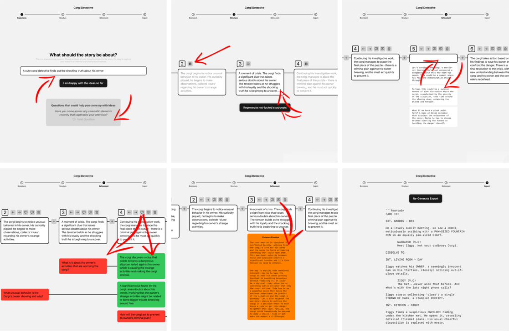

# wr-AI-ter
An interactive iOS app designed by [@Sebastian Burgkart](https://github.com/Think-42) to assist screenwriters in developing high-quality scripts while maintaining a sense of authorship, using AI at each step.

> ### Update!
> We have also developed and enhanced the app as a new [**website**](https://kilab.hff-muc.de/wraiter/), making it accessible on non-iOS devices as well.

&nbsp;  

### wr-AI-ter iOS App:

This application was written with XCode Version 15.0 and tested on iOS 17/iPadOS 17.

#### Installation Instructions:
1. Clone this repository.
2. Open the `WrAIter4.xcodeproj` file in XCode.
3. Replace the placeholder `apiToken` in the file `WrAIter4/AI/AI.swift` with your valid API key.  
   - You can obtain your API key here: [OpenAI](https://platform.openai.com/docs/quickstart/create-and-export-an-api-key).
4. Run the app on an iOS 17+ device or simulator.

#### Features:
- **Four Stages:** The app guides screenwriters through four stages: Ideation, Structure, Refinement, and Export.
- **AI Assistance:** Helps speed up the writing process while preserving authorship perception.

### Research and Publications:
In our IMX 2024 paper, [wr-AI-ter: Enhancing Ownership Perception in AI-Driven Script Writing](https://dl.acm.org/doi/10.1145/3639701.3656325), we explore the development of wr-AI-ter. Our study with 23 participants showed that AI can enhance script quality and efficiency without diminishing the writer's sense of ownership.

### Prerequisites:
- XCode 15.0+
- iOS 17/iPadOS 17+
- A valid API key for the AI service

### License:
This project is licensed under the MIT License - see the [LICENSE](./LICENSE) file for details.
